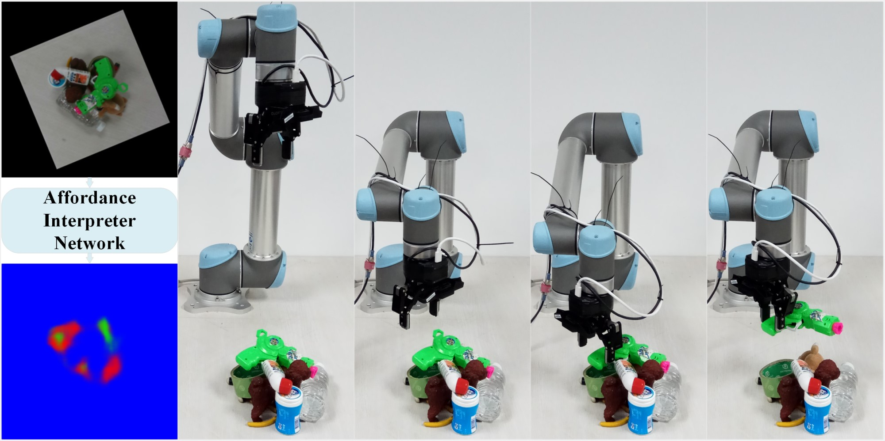

**MetaGrasp: Data Efficient Grasping by Affordance Interpreter Network** 

**Junhao Cai, Hui Cheng, Zhanpeng Zhang, Jingcheng Su**

Presented at the 2019 International Conference on Robotics and Automation (ICRA).

**Abstract** Data-driven approach for grasping shows significant advance recently. 
But these approaches usually require much training data. 
To increase the efficiency of grasping data collection, 
this paper presents a novel grasp training system 
including the whole pipeline from data collection to model inference. 
The system can collect effective grasp sample with a corrective strategy 
assisted by antipodal grasp rule, and we design an affordance interpreter network 
to predict pixelwise grasp affordance map. 
We define graspability, ungraspability and background as grasp affordances. 
The key advantage of our system is that the pixel-level affordance interpreter network 
trained with only a small number of grasp samples under antipodal rule 
can achieve significant performance on totally unseen objects and backgrounds. 
The training sample is only collected in simulation. 
Extensive qualitative and quantitative experiments demonstrate the accuracy 
and robustness of our proposed approach. In the real-world grasp experiments, 
we achieve a grasp success rate of 93\% on a set of household items and 91% 
on a set of adversarial items with only about 6,300 simulated samples. 
We also achieve 87% accuracy in clutter scenario. 
Although the model is trained using only RGB image, 
when changing the background textures, it also performs well 
and can achieve even 94% accuracy on the set of adversarial objects, 
which outperforms current state-of-the-art methods.

**Preprint**: coming soon

**Video**: [Youtube](https://youtu.be/rulggCZkSPg), [Youku](http://v.youku.com/v_show/id_XNDA2ODk4NTMyNA==.html?spm=a2hzp.8244740.0.0)

**Code**: comming soon

